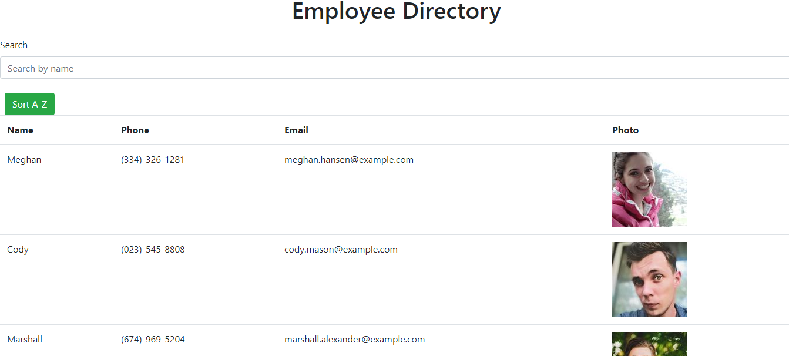

# Employee Directory

This React application renders a directory of employees showing their name, email, phone, and a photo. The user can filter the table by searching for a name or they can sort the table to display all employees in alphabetical order.

## Concepts used

This was my first React app so utilizing the core React concepts was my main goal here. I broke the app down into smaller components and handled the filter and sort functions in App.js. I used a hook to get the filter function to work by keeping track of the searchbar's state. To populate the employee directory I mapped over the employeeJson array to dynamically render all of the employees.

## How it looks

See it on GitHub: https://tlam1288.github.io/employee-directory/
GitHub repo: https://github.com/tlam1288/employee-directory

